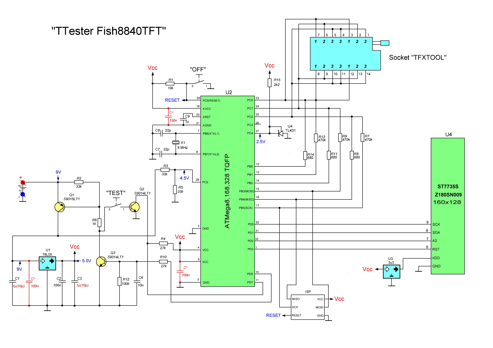

# Readme

This repo contains files and useful references from the Transistor Tester project with a focus on the FISH 8840 clone.

The transistor tester project page is: https://www.mikrocontroller.net/articles/AVR_Transistortester & the repo is https://www.mikrocontroller.net/svnbrowser/transistortester/. (Original by: Markus Frejek & continued by Karl-Heinz Kübbeler) known as the _k_version_

The version used is from here: https://github.com/madires/Transistortester-Warehouse (from: Markus Reschke) known as the _m_version_

## Info

The Transistor Tester is a unit which allows quick measuring of common electronic components (capacitors, inductors, resistors, BJTs, MOSFETs, schottky/zener diodes) and more (depending on firmware) using basic components.

See the large accompanying PDFs (k & m versions) for more info on all the capabilities.

Here is a large topic about these over at EEVBlog: https://www.eevblog.com/forum/testgear/$20-lcr-esr-transistor-checker-project/

## FISH8840 Clone

There are multiple Chinese clones on the market, including the FISH8840 - which has a TFT colour screen. Some info in this repo contains references to different variants of this clone (as it has gone through revisions...) So please read carefully (for example, in the PDFs there are references to a badly designed battery readout circuit using a voltage divider - which would drain the battery even when not in use. This is not the case with the later models)

.jpg)

### Schematic

A later model (battery readout now done through a BJT)

(from: https://yadi.sk/d/yW8xa5NJgUo5z/Fish-8840TFT)

### Code

`config.h` & `config_328.h` were adjusted to the FISH8840

(Screen settings initially based on info from the "Clones" file)

### Uploading

There are multiple reports that the 3.3V regulator for the screen needs to be removed beforing flashing, otherwise it fries.

Building / compiling can be done by running `make upload`
